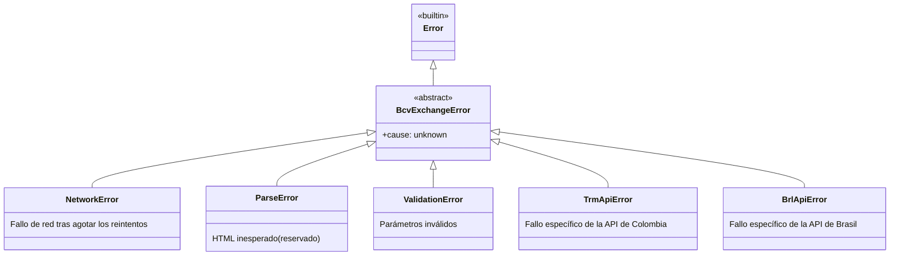

# Referencia de la API

Documentación exhaustiva de los símbolos exportados por `bcv-exchange-rate`.

## Tabla de contenido

- [Funciones](#funciones)
  - [`getBcvRates`](#getbcvrates)
  - [`getBcvHistory`](#getbcvhistory)
  - [`getTrmRates`](#gettrmrates)
  - [`getBrlRates`](#getbrlrates)
  - [API de caché](#api-de-caché)
- [Interfaces de entrada](#interfaces-de-entrada)
  - [`RequestOptions`](#requestoptions)
  - [`BcvParams`](#bcvparams)
  - [`TrmParams`](#trmparams)
  - [`BrlParams`](#brlparams)
- [Contrato de respuesta unificado](#contrato-de-respuesta-unificado)
  - [`Pagination`](#pagination)
  - [`DateRange`](#daterange)
- [Interfaces de respuesta](#interfaces-de-respuesta)
  - [`BcvResponse`](#bcvresponse)
  - [`BcvBankRate`](#bcvbankrate)
  - [`TrmResponse`](#trmresponse)
  - [`BrlResponse`](#brlresponse)
  - [`BrlRate`](#brlrate)
- [Interfaces de caché](#interfaces-de-caché)
  - [`CacheEntry`](#cacheentry)
  - [`CacheStore`](#cachestore)
  - [`CacheStats`](#cachestats)
- [Tipos](#tipos)
  - [`Currency`](#currency)
  - [`SectionStatus`](#sectionstatus)
  - [`Logger`](#logger)
- [Clases de error](#clases-de-error)

---

## Funciones

### `getBcvRates`

```typescript
function getBcvRates(params?: BcvParams): Promise<BcvResponse>;
```

Obtiene las tasas oficiales actuales del Banco Central de Venezuela y, opcionalmente, el historial de tasas informativas del sistema bancario.

**Comportamiento:**

- Si `includeCurrent` es `true` (valor por defecto), consulta `https://www.bcv.org.ve/`.
- Si `includeHistory` es `true` (valor por defecto), delega en [`getBcvHistory`](#getbcvhistory).
- Si una sección falla y la otra también se solicitó, la función **no lanza**: marca `status.<sección>: 'failed'` y devuelve los datos disponibles.
- Si la única sección solicitada falla, la función lanza la excepción correspondiente.

**Lanza:**

- `ValidationError`: `days < 1` o `page < 0`.
- `NetworkError`: fallo transitorio no recuperado tras los reintentos, con todas las secciones solicitadas fallidas.

**Ejemplo:**

```typescript
const result = await getBcvRates({
  currencies: ['USD', 'EUR'],
  days: 14,
  page: 0,
  retries: 3,
  cacheTtlMs: 60_000,
});

if (result.status.current === 'failed') {
  console.warn('Tasa actual no disponible; se usa el historial');
}
```

---

### `getBcvHistory`

```typescript
function getBcvHistory(params?: BcvParams): Promise<Pick<BcvResponse, 'history' | 'pagination' | 'range'>>;
```

Obtiene únicamente el historial bancario. Es útil para reportes o auditorías que no necesitan la portada.

**Lanza:**

- `ValidationError`: `days < 1` o `page < 0`.
- `NetworkError`: la petición no pudo recuperarse.

**Ejemplo:**

```typescript
const { history, pagination, range } = await getBcvHistory({ days: 30, page: 2 });
if (pagination.hasMore) {
  // hay más páginas en el portal
}
```

---

### `getTrmRates`

```typescript
function getTrmRates(params?: TrmParams): Promise<TrmResponse | null>;
```

Consulta la Tasa Representativa del Mercado de Colombia publicada por la Superintendencia Financiera en `datos.gov.co`.

**Devuelve:** `null` cuando la API responde con una colección vacía o con una carga no iterable.

**Lanza:**

- `ValidationError`: `limit` fuera del rango `[1, 1000]`, `offset < 0` o `days < 1`.
- `TrmApiError`: el endpoint respondió con error o falló la red.

**Ejemplo:**

```typescript
const trm = await getTrmRates({ limit: 30, days: 60 });
if (trm) {
  console.log(
    `TRM actual: ${trm.current.value} COP (ventana ${trm.range?.startDate} → ${trm.range?.endDate})`
  );
}
```

---

### `getBrlRates`

```typescript
function getBrlRates(params?: BrlParams): Promise<BrlResponse | null>;
```

Consulta la cotización oficial USD/BRL (dólar PTAX, compra y venta) publicada por el Banco Central do Brasil en su API de datos abiertos (Olinda/OData).

**Devuelve:** `null` cuando la ventana consultada no contiene cotizaciones (por ejemplo, si solo abarca fines de semana o feriados, días en los que no se publica PTAX).

**Lanza:**

- `ValidationError`: `days < 1`, `limit` fuera del rango `[1, 1000]` u `offset < 0`.
- `BrlApiError`: el endpoint respondió con error o falló la red.

**Ejemplo:**

```typescript
const brl = await getBrlRates({ days: 30, limit: 5, offset: 5 });
if (brl) {
  console.log(`PTAX venta: ${brl.current.sell} BRL por USD (${brl.current.dateTime})`);
}
```

---

### API de caché

La librería activa la caché por defecto (60 s). Estas funciones permiten administrarla.

```typescript
function clearCache(): void;
function createInMemoryCache(options?: { maxEntries?: number }): CacheStore;
function setDefaultCache(store: CacheStore): void;
function getDefaultCache(): CacheStore;
function getCacheStats(): CacheStats;
function resetCacheStats(): void;
```

| Función                   | Descripción                                                                         |
| ------------------------- | ----------------------------------------------------------------------------------- |
| `clearCache()`            | Vacía la caché por defecto. No toca los stores inyectados por llamada.              |
| `createInMemoryCache(o?)` | Factoría LRU en memoria con `maxEntries` (valor por defecto `200`, mínimo 1).       |
| `setDefaultCache(store)`  | Reemplaza la caché global por defecto. Útil para instalar un backend personalizado. |
| `getDefaultCache()`       | Devuelve la instancia actual de la caché por defecto.                               |
| `getCacheStats()`         | Snapshot inmutable: `{ hits, misses, staleServes, size }`.                          |
| `resetCacheStats()`       | Reinicia los contadores globales. No borra entradas.                                |

Guía completa: [Caché y resiliencia](./guides/caching.md).

---

## Interfaces de entrada

### `RequestOptions`

Opciones compartidas por todas las funciones públicas.

| Propiedad         | Tipo                        | Default      | Descripción                                                                          |
| ----------------- | --------------------------- | ------------ | ------------------------------------------------------------------------------------ |
| `timeout`         | `number`                    | `25000`      | Tiempo máximo HTTP en milisegundos.                                                  |
| `strictSSL`       | `boolean`                   | `true`       | Si es `false`, se desactiva la validación TLS y se emite un `warn`.                  |
| `userAgent`       | `string`                    | UA de Chrome | Cabecera `User-Agent`.                                                               |
| `logger`          | [`Logger`](#logger)         | Silencioso   | Logger basado en interfaz. Con `BCV_DEBUG` definido, usa `console` si no se inyecta. |
| `retries`         | `number`                    | `2`          | Intentos adicionales ante fallo transitorio (total = `retries + 1`).                 |
| `retryDelayMs`    | `number`                    | `400`        | Retardo base del backoff exponencial (`base * 2^attempt`).                           |
| `cacheTtlMs`      | `number`                    | `60000`      | TTL _fresh_. `0` desactiva la caché para esta llamada.                               |
| `cacheStaleTtlMs` | `number`                    | `0`          | Ventana extra (ms) para servir _stale_ si el upstream falla.                         |
| `cacheStore`      | [`CacheStore`](#cachestore) | LRU global   | Backend personalizado para esta llamada. Sin él, usa el global por defecto.          |

### `BcvParams`

Extiende [`RequestOptions`](#requestoptions).

| Propiedad        | Tipo                     | Default | Descripción                                |
| ---------------- | ------------------------ | ------- | ------------------------------------------ |
| `currencies`     | `Currency \| Currency[]` | Todas   | Filtra el bloque `current`.                |
| `includeCurrent` | `boolean`                | `true`  | Consulta la portada.                       |
| `includeHistory` | `boolean`                | `true`  | Consulta el histórico bancario.            |
| `days`           | `number`                 | `7`     | Rango en días (≥ 1) hacia atrás desde hoy. |
| `page`           | `number`                 | `0`     | Número de página (≥ 0) del histórico.      |

### `TrmParams`

Extiende [`RequestOptions`](#requestoptions).

| Propiedad | Tipo     | Default    | Descripción                                                        |
| --------- | -------- | ---------- | ------------------------------------------------------------------ |
| `limit`   | `number` | `10`       | Registros a devolver. Rango `[1, 1000]`.                           |
| `offset`  | `number` | `0`        | Desplazamiento para paginar.                                       |
| `days`    | `number` | Sin filtro | Ventana en días (≥ 1) hacia atrás (`vigenciahasta >= hoy - días`). |

### `BrlParams`

Extiende [`RequestOptions`](#requestoptions).

| Propiedad | Tipo     | Default         | Descripción                                             |
| --------- | -------- | --------------- | ------------------------------------------------------- |
| `days`    | `number` | `7`             | Ventana en días (≥ 1) hacia atrás desde hoy.            |
| `limit`   | `number` | Toda la ventana | Registros a devolver (OData `$top`). Rango `[1, 1000]`. |
| `offset`  | `number` | `0`             | Registros a saltar (OData `$skip`).                     |

---

## Contrato de respuesta unificado

Desde la versión 2.0, las tres fuentes comparten el mismo esqueleto de salida: `current` + `history` + [`pagination`](#pagination) + [`range`](#daterange). Los campos que no aplican al paradigma de una fuente son `null`, nunca se omiten, de modo que el shape es idéntico y predecible.

### `Pagination`

```typescript
interface Pagination {
  limit: number | null; // null: no solicitado, o la fuente pagina por página (BCV)
  offset: number | null; // null: la fuente pagina por página (BCV)
  page: number | null; // null: la fuente pagina por limit/offset (TRM, BRL)
  count: number; // registros devueltos en esta respuesta
  hasMore: boolean | null; // null: la fuente no puede saberlo (TRM, BRL)
}
```

| Campo            | BCV                     | TRM    | BRL                                   |
| ---------------- | ----------------------- | ------ | ------------------------------------- |
| `limit`/`offset` | `null` (usa `page`)     | reales | reales (`limit: null` si no se pidió) |
| `page`           | real                    | `null` | `null`                                |
| `hasMore`        | real (pager del portal) | `null` | `null`                                |

### `DateRange`

```typescript
interface DateRange {
  startDate: string; // ISO 8601 (YYYY-MM-DD)
  endDate: string;
}
```

Ventana de días aplicada a la consulta. Es `null` cuando no se aplicó ventana: TRM sin `days`, o BCV con el histórico omitido o fallido.

---

## Interfaces de respuesta

### `BcvResponse`

```typescript
interface BcvResponse {
  current: Partial<Record<Currency, number>>;
  effectiveDate: string;
  history: BcvBankRate[];
  pagination: Pagination;
  range: DateRange | null;
  status: {
    current: SectionStatus;
    history: SectionStatus;
  };
}
```

`status` permite distinguir tres casos por sección:

- `'ok'`: la sección se completó con éxito.
- `'skipped'`: la sección no se solicitó (`includeCurrent: false` o `includeHistory: false`).
- `'failed'`: la sección se solicitó, pero falló; los demás campos quedan vacíos.

### `BcvBankRate`

```typescript
interface BcvBankRate {
  date: string; // ISO 8601 (YYYY-MM-DD) cuando se reconoce el formato
  bank: string;
  buy: number | null; // null si no pudo parsearse
  sell: number | null;
}
```

### `TrmResponse`

```typescript
interface TrmResponse {
  current: {
    value: number;
    unit: string;
    validityDate: string;
  };
  history: Array<{
    value: number;
    validityDate: string;
  }>;
  pagination: Pagination;
  range: DateRange | null; // null cuando no se pasó days
}
```

### `BrlResponse`

```typescript
interface BrlResponse {
  current: BrlRate;
  history: BrlRate[];
  pagination: Pagination; // limit null cuando se devolvió la ventana completa
  range: DateRange | null;
}
```

### `BrlRate`

```typescript
interface BrlRate {
  buy: number; // cotacaoCompra (BRL por USD)
  sell: number; // cotacaoVenda
  dateTime: string; // dataHoraCotacao (YYYY-MM-DD HH:mm:ss.SSS)
}
```

---

## Interfaces de caché

### `CacheEntry`

```typescript
interface CacheEntry<T = unknown> {
  value: T;
  expiresAt: number; // epoch ms: límite de fresh hit
  staleUntil: number; // epoch ms: límite para servir stale-on-error
}
```

### `CacheStore`

```typescript
interface CacheStore {
  readonly size: number;
  get(key: string): CacheEntry | undefined;
  set(key: string, entry: CacheEntry): void;
  delete(key: string): void;
  clear(): void;
}
```

Backend pluggable para la caché. La interfaz es **síncrona**; para backends asíncronos (Redis, DynamoDB) escribe un adaptador con una caché local síncrona. Ejemplo completo en la [guía de caché](./guides/caching.md#backend-custom-la-interfaz-cachestore).

### `CacheStats`

```typescript
interface CacheStats {
  hits: number; // total de llamadas servidas desde la caché fresh
  misses: number; // llamadas que tuvieron que ir al upstream
  staleServes: number; // llamadas degradadas sirviendo caché stale
  size: number; // entradas en la caché por defecto (no refleja stores custom)
}
```

---

## Tipos

### `Currency`

```typescript
type Currency = 'USD' | 'EUR' | 'CNY' | 'TRY' | 'RUB';
```

Unión literal de monedas soportadas. TypeScript detectará errores de tipo al pasar valores no válidos.

### `SectionStatus`

```typescript
type SectionStatus = 'ok' | 'skipped' | 'failed';
```

### `Logger`

```typescript
interface Logger {
  info(message: string, meta?: Record<string, unknown>): void;
  debug(message: string, meta?: Record<string, unknown>): void;
  warn(message: string, meta?: Record<string, unknown>): void;
  error(message: string, meta?: Record<string, unknown>): void;
}
```

Compatible con `console`, `winston`, `pino`, `bunyan` y la mayoría de loggers. Consulta la [guía de logging](./guides/logging.md) para ejemplos de adaptación.

---

## Clases de error

Todas heredan de `BcvExchangeError`, que a su vez extiende `Error`.


```mermaid
classDiagram
    class Error {
        <<builtin>>
    }
    class BcvExchangeError {
        <<abstract>>
        +cause: unknown
    }
    class NetworkError {
        Fallo de red tras agotar los reintentos
    }
    class ParseError {
        HTML inesperado (reservado)
    }
    class ValidationError {
        Parámetros inválidos
    }
    class TrmApiError {
        Fallo específico de la API de Colombia
    }
    class BrlApiError {
        Fallo específico de la API de Brasil
    }

    Error <|-- BcvExchangeError
    BcvExchangeError <|-- NetworkError
    BcvExchangeError <|-- ParseError
    BcvExchangeError <|-- ValidationError
    BcvExchangeError <|-- TrmApiError
    BcvExchangeError <|-- BrlApiError
```

Detalles y patrones de captura en la [guía de manejo de errores](./guides/errors.md).
