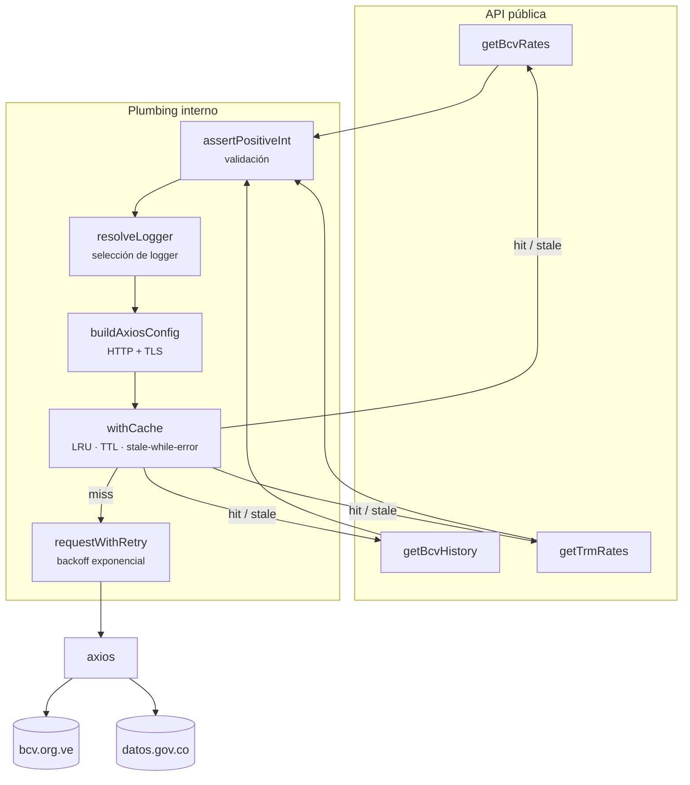
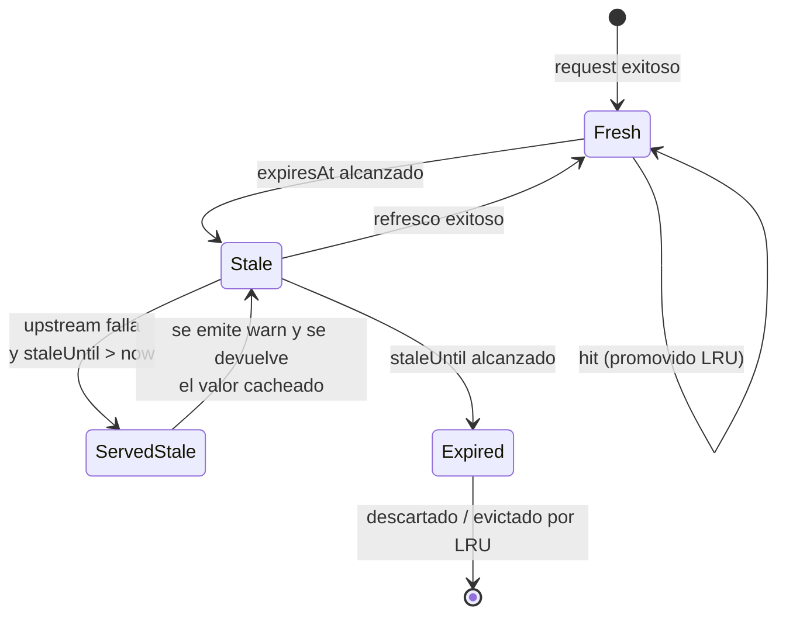

# Arquitectura interna

Esta página describe cómo está construida la librería por dentro. Es útil para contribuidores y para quienes necesiten entender el comportamiento exacto del scraping.

## Vista general



## Flujo de una llamada

1. **Validación** (`assertPositiveInt`). Las entradas se validan antes de cualquier I/O. Los errores se elevan como `ValidationError`.
2. **Resolución del logger** (`resolveLogger`). La prioridad es: `options.logger` > `console` (si `BCV_DEBUG` está definido) > logger silencioso.
3. **Configuración de Axios** (`buildAxiosConfig`). Aplica `timeout`, `User-Agent`, cabeceras y `httpsAgent` con `rejectUnauthorized` según `strictSSL`. Emite `warn` cuando TLS está relajado.
4. **Caché** (`withCache`). Con `cacheTtlMs > 0`, el resultado se memoriza por clave de URL. La clave no incluye el TTL, por lo que múltiples consumidores comparten la entrada.
5. **Reintentos con backoff exponencial** (`requestWithRetry`). Se espera `base * 2^attempt` ms entre intentos. Todos los fallos finales se envuelven en `NetworkError`.
6. **Parseo** (cheerio para BCV; `JSON.parse` para TRM). Los valores numéricos pasan por `parseVenezuelanNumber`, que tolera el formato `1.234,56`.

## Ciclo de vida de una entrada en caché



## Garantías del contrato

### `getBcvRates`

El contrato tiene un comportamiento **asimétrico ante fallos**, diseñado para maximizar los datos útiles:

- Si se solicitan ambas secciones y una falla, la otra se entrega igual con `status.<sección>: 'failed'`.
- Si se solicita solo una sección y esa falla, la función lanza la excepción.

Esto permite que los consumidores que priorizan disponibilidad (por ejemplo, dashboards) sigan funcionando con datos parciales, mientras que los que priorizan consistencia (scripts de auditoría) pueden invocar con `includeHistory: false` y recibir excepciones claras.

### Fechas

- `effectiveDate` se extrae del atributo `content` de `.date-display-single` (ISO) o del texto visible como alternativa.
- `history[].date` se normaliza a ISO 8601 (`YYYY-MM-DD`) cuando el formato de entrada coincide con `DD-MM-YYYY` o `DD-MM-YY`. Si no, se devuelve tal cual.

### Caché

- **En memoria, por proceso.** No sobrevive a reinicios. Para persistencia, inyecta un `cacheStore` respaldado por Redis u otro backend.
- **Clave determinista** basada en la URL. Múltiples consumidores con distinto TTL comparten la entrada.
- **`cacheTtlMs: 0` desactiva completamente** tanto la escritura como la lectura.
- **`cacheStaleTtlMs > 0`** habilita el modo _stale-while-error_: si el upstream falla y existe una entrada vencida dentro de la ventana, esa entrada se sirve y se registra un `warn`.

### Reintentos

- Solo se activan en la capa de transporte (`axios.get`). No se reintentan los fallos de parseo ni de validación.
- El backoff es exponencial: `retryDelayMs * 2^attempt`. Con los valores por defecto (`400 ms`, 2 reintentos): las esperas son de 400 ms y 800 ms.
- El total de intentos es `retries + 1`.

## Decisiones de diseño

### ¿Por qué un monolito en un archivo?

La librería es pequeña (~450 LOC) y el scraping del BCV cambia en bloque. Dividirla en módulos internos añadiría indirección sin beneficio real para un consumidor que sólo llama a tres funciones. El tamaño justifica el archivo único.

### ¿Por qué `winston` como peer opcional?

Forzar `winston` como dependencia directa añadiría ~450 KB al árbol de cualquier consumidor, incluso los que no quieren logs. La librería acepta cualquier objeto con la API `{info, debug, warn, error}` y deja `winston` como _peer_ opcional para quienes sí lo usan.

### ¿Por qué `strictSSL: true` por defecto?

Para evitar un hueco de seguridad: un valor por defecto permisivo permitiría que un usuario instalara la librería y, sin saberlo, expusiera su aplicación a un MITM. Por eso la desactivación es explícita y cada llamada con `strictSSL: false` emite un `warn`, de modo que la decisión sea consciente. Consulta la [guía de seguridad](./guides/security.md).

### ¿Por qué `getTrmRates` devuelve `null`?

Para distinguir «sin datos» de «error» en el consumidor. Si la API responde con HTTP 200 y `[]`, esa es una situación normal (por ejemplo, no hay registros el primer día del año), no un error de red. Lanzar en ese caso obligaría al consumidor a capturar excepciones esperadas.

## Archivos del proyecto

```text
.
├── index.ts                   # Código fuente único
├── index.spec.ts              # Suite de pruebas
├── package.json
├── tsconfig.json              # Configuración base (usada por el IDE y los tests)
├── tsconfig.cjs.json          # Build CommonJS → dist/cjs
├── tsconfig.esm.json          # Build ESM → dist/esm
├── tsconfig.types.json        # Emisión de declaraciones → dist/types
├── jest.config.js             # Umbral de cobertura del 100 %
├── eslint.config.mjs          # Flat config de ESLint
├── .prettierrc.json           # Configuración de Prettier
├── .editorconfig              # Reglas de editor
├── .gitattributes             # Normalización de saltos de línea
├── docs/                      # Esta documentación
└── .github/                   # CI, plantillas y Dependabot
```

## Pruebas

- Todas las pruebas corren 100 % en proceso con `axios-mock-adapter`.
- No se hacen llamadas de red reales. La caché se reinicia en `afterEach` mediante `clearCache()` y `resetCacheStats()`.
- El umbral de cobertura del 100 % está forzado en `jest.config.js`. Cualquier regresión falla el CI.
