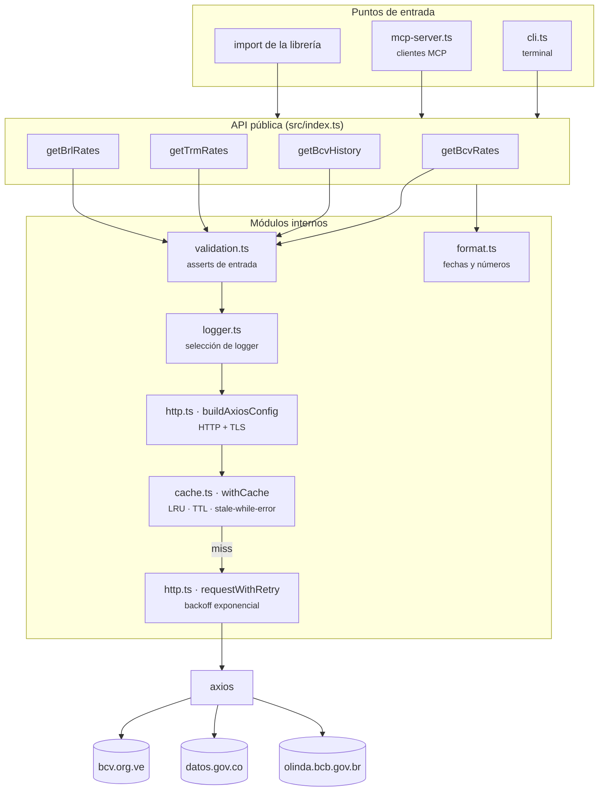
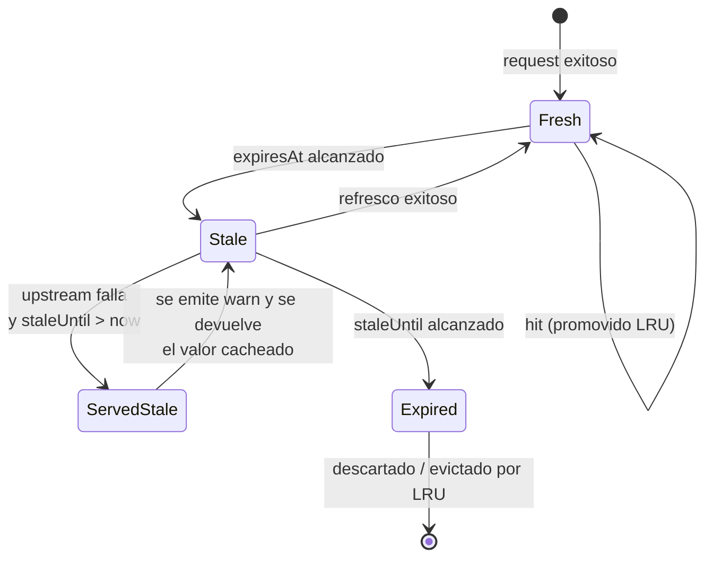
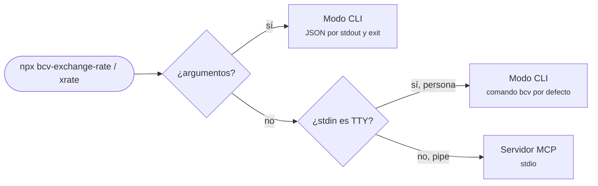

# Arquitectura interna

Esta página describe cómo está construida la librería por dentro. Es útil para contribuidores y para quienes necesiten entender el comportamiento exacto del scraping y de las integraciones.

## Vista general


```mermaid
flowchart TD
    subgraph entry["Puntos de entrada"]
        CLI[cli.ts<br/><small>terminal</small>]
        MCP[mcp-server.ts<br/><small>clientes MCP</small>]
        LIB[import de la librería]
    end
    subgraph api["API pública (src/index.ts)"]
        A[getBcvRates]
        B[getBcvHistory]
        C[getTrmRates]
        D[getBrlRates]
    end
    subgraph plumbing["Módulos internos"]
        V[validation.ts<br/><small>asserts de entrada</small>]
        L[logger.ts<br/><small>selección de logger</small>]
        Cfg[http.ts · buildAxiosConfig<br/><small>HTTP + TLS</small>]
        Cache[cache.ts · withCache<br/><small>LRU · TTL · stale-while-error</small>]
        Retry[http.ts · requestWithRetry<br/><small>backoff exponencial</small>]
        F[format.ts<br/><small>fechas y números</small>]
    end
    AX[axios]
    Up1[(bcv.org.ve)]
    Up2[(datos.gov.co)]
    Up3[(olinda.bcb.gov.br)]

    CLI --> api
    MCP --> api
    LIB --> api
    A --> V
    B --> V
    C --> V
    D --> V
    V --> L --> Cfg --> Cache
    Cache -->|miss| Retry
    Retry --> AX
    AX --> Up1
    AX --> Up2
    AX --> Up3
    api --> F
```

## Estructura de módulos

```text
src/
├── index.ts            # Barrel: re-exporta la API pública completa
├── types.ts            # Contratos de tipos (params, respuestas, Pagination, DateRange)
├── errors.ts           # Jerarquía de errores tipada
├── validation.ts       # Asserts de entrada (fallan antes de cualquier I/O)
├── format.ts           # Fechas Drupal/PTAX/ISO y números en formato venezolano
├── logger.ts           # Resolución del logger (inyectado > BCV_DEBUG > silencioso)
├── cache.ts            # LRU en memoria, stores pluggables, stale-while-error
├── http.ts             # Configuración axios + reintentos con backoff
├── cli.ts              # Modo terminal (npx / xrate)
├── mcp-server.ts       # Servidor Model Context Protocol (stdio)
└── sources/
    ├── bcv.ts          # Venezuela: scraping del portal del BCV
    ├── trm.ts          # Colombia: API Socrata de datos.gov.co
    └── brl.ts          # Brasil: API OData PTAX del BCB
```

Reglas de dependencia entre capas:

- `types.ts` no importa nada (solo declara tipos).
- `errors.ts`, `format.ts` no dependen de otros módulos de la librería.
- `validation.ts`, `logger.ts`, `cache.ts`, `http.ts` solo dependen de `types`/`errors`.
- `sources/*` orquesta las capas anteriores; cada fuente es independiente de las demás.
- `cli.ts` y `mcp-server.ts` consumen únicamente la API pública del barrel, como cualquier consumidor externo.

## Flujo de una llamada

1. **Validación** (`validation.ts`). Las entradas se validan antes de cualquier I/O. Los errores se elevan como `ValidationError`.
2. **Resolución del logger** (`logger.ts`). La prioridad es: `options.logger` > `console` (si `BCV_DEBUG` está definido) > logger silencioso.
3. **Configuración de Axios** (`http.ts`). Aplica `timeout`, `User-Agent`, cabeceras y `httpsAgent` con `rejectUnauthorized` según `strictSSL`. Emite `warn` cuando TLS está relajado.
4. **Caché** (`cache.ts`). Con `cacheTtlMs > 0`, el resultado se memoriza por clave de URL. La clave no incluye el TTL, por lo que múltiples consumidores comparten la entrada.
5. **Reintentos con backoff exponencial** (`http.ts`). Se espera `base * 2^attempt` ms entre intentos. Todos los fallos finales se envuelven en `NetworkError`.
6. **Parseo** (cheerio para BCV; JSON para TRM y PTAX). Los valores del BCV pasan por `parseVenezuelanNumber` (`format.ts`), que tolera el formato `1.234,56`.

## Ciclo de vida de una entrada en caché


```mermaid
stateDiagram-v2
    [*] --> Fresh: request exitoso
    Fresh --> Fresh: hit (promovido LRU)
    Fresh --> Stale: expiresAt alcanzado
    Stale --> Fresh: refresco exitoso
    Stale --> ServedStale: upstream falla<br/>y staleUntil > now
    ServedStale --> Stale: se emite warn y se devuelve<br/>el valor cacheado
    Stale --> Expired: staleUntil alcanzado
    Expired --> [*]: descartado / evictado por LRU
```

## Garantías del contrato

### Contrato de respuesta unificado

Las tres fuentes devuelven el mismo esqueleto (`current`, `history`, `pagination`, `range`). Los campos de `pagination` que no aplican al paradigma de una fuente son `null`, nunca se omiten. Detalle completo en la [referencia de la API](./api-reference.md#contrato-de-respuesta-unificado).

### `getBcvRates`

El contrato tiene un comportamiento **asimétrico ante fallos**, diseñado para maximizar los datos útiles:

- Si se solicitan ambas secciones y una falla, la otra se entrega igual con `status.<sección>: 'failed'`.
- Si se solicita solo una sección y esa falla, la función lanza la excepción.

Esto permite que los consumidores que priorizan disponibilidad (por ejemplo, dashboards) sigan funcionando con datos parciales, mientras que los que priorizan consistencia (scripts de auditoría) pueden invocar con `includeHistory: false` y recibir excepciones claras.

### Particularidades del portal del BCV

Conocimiento operativo embebido en `sources/bcv.ts` y `format.ts`:

- **Meses del filtro de fechas**: el portal (Drupal en español) espera abreviaturas traducidas de 3 letras **excepto mayo**, que se envía como la palabra completa `Mayo`. Enviar `May`, `Enero` o `Junio` hace que el filtro falle silenciosamente y la vista vuelva vacía.
- **Selector de tabla**: la página renderiza además un bloque lateral de 3 columnas cuya tabla coincide con el selector genérico; el parser prioriza la vista principal (`view-tasas-sistema-bancario-full`).
- **Paginación**: el portal usa Bootstrap (`ul.pagination li.next`); se mantiene `.pager-next` como fallback del marcado Drupal antiguo.
- **TLS**: el portal sirve una cadena de certificados incompleta. La librería mantiene `strictSSL: true` por defecto; la CLI y las tools MCP lo relajan explícitamente (documentado).

### Fechas

- `effectiveDate` se extrae del atributo `content` de `.date-display-single` (ISO) o del texto visible como alternativa.
- `history[].date` se normaliza a ISO 8601 (`YYYY-MM-DD`) cuando el formato de entrada coincide con `DD-MM-YYYY` o `DD-MM-YY`. Si no, se devuelve tal cual.
- La API PTAX exige fechas `MM-DD-YYYY`; la API Socrata acepta ISO en `$where`.

### Caché

- **En memoria, por proceso.** No sobrevive a reinicios. Para persistencia, inyecta un `cacheStore` respaldado por Redis u otro backend.
- **Clave determinista** basada en la URL. Múltiples consumidores con distinto TTL comparten la entrada.
- **`cacheTtlMs: 0` desactiva completamente** tanto la escritura como la lectura.
- **`cacheStaleTtlMs > 0`** habilita el modo _stale-while-error_: si el upstream falla y existe una entrada vencida dentro de la ventana, esa entrada se sirve y se registra un `warn`.

### Reintentos

- Solo se activan en la capa de transporte (`axios.get`). No se reintentan los fallos de parseo ni de validación.
- El backoff es exponencial: `retryDelayMs * 2^attempt`. Con los valores por defecto (`400 ms`, 2 reintentos): las esperas son de 400 ms y 800 ms.
- El total de intentos es `retries + 1`.

## Puntos de entrada del binario

`bin/mcp.js` decide el modo según el contexto de invocación:


```mermaid
flowchart LR
    Start([npx bcv-exchange-rate / xrate]) --> Args{¿argumentos?}
    Args -->|sí| CLI[Modo CLI<br/><small>JSON por stdout y exit</small>]
    Args -->|no| TTY{¿stdin es TTY?}
    TTY -->|sí, persona| CLI2[Modo CLI<br/><small>comando bcv por defecto</small>]
    TTY -->|no, pipe| Server[Servidor MCP<br/><small>stdio</small>]
```

## Decisiones de diseño

### ¿Por qué módulos por responsabilidad y una fuente por archivo?

Cada fuente upstream (portal del BCV, API Socrata, API OData del BCB) cambia de forma independiente y con conocimiento operativo propio. Aislarlas en `sources/*` permite arreglar una sin tocar las demás, y las capas transversales (caché, HTTP, validación) se prueban y razonan por separado.

### ¿Por qué `winston` como peer opcional?

Forzar `winston` como dependencia directa añadiría ~450 KB al árbol de cualquier consumidor, incluso los que no quieren logs. La librería acepta cualquier objeto con la API `{info, debug, warn, error}` y deja `winston` como _peer_ opcional para quienes sí lo usan.

### ¿Por qué `strictSSL: true` por defecto en la librería pero `false` en CLI/MCP?

La librería mantiene el default seguro: un valor permisivo expondría a MITM a quien la integre sin leer la documentación. La CLI y las tools MCP son contextos de consulta interactiva donde el portal del BCV fallaría siempre por su cadena de certificados incompleta; ahí el default se relaja, está documentado en `--help` y en los esquemas de las tools, y puede revertirse con `--strict-ssl` / `strictSSL: true`. Consulta la [guía de seguridad](./guides/security.md).

### ¿Por qué `getTrmRates`/`getBrlRates` devuelven `null`?

Para distinguir «sin datos» de «error» en el consumidor. Si la API responde con HTTP 200 y una colección vacía, esa es una situación normal (fines de semana sin PTAX, primer día del año sin TRM), no un error de red. Lanzar en ese caso obligaría al consumidor a capturar excepciones esperadas.

## Archivos del proyecto

```text
.
├── src/                       # Código fuente modular (ver estructura arriba)
├── bin/mcp.js                 # Punto de entrada del binario (CLI / servidor MCP)
├── package.json
├── tsconfig.json              # Configuración base (IDE)
├── tsconfig.cjs.json          # Build CommonJS → dist/cjs
├── tsconfig.esm.json          # Build ESM → dist/esm
├── tsconfig.types.json        # Emisión de declaraciones → dist/types
├── tsconfig.mcp.json          # Build de cli.ts y mcp-server.ts → dist/cjs
├── tsconfig.spec.json         # Resolución node16 para los tests (subpaths del SDK MCP)
├── jest.config.js             # Umbral de cobertura del 100 %
├── eslint.config.mjs          # Flat config de ESLint
├── .prettierrc.json           # Configuración de Prettier
├── .editorconfig              # Reglas de editor
├── .gitattributes             # Normalización de saltos de línea
├── docs/                      # Esta documentación
└── .github/                   # CI, plantillas y Dependabot
```

## Pruebas

- Tres suites: `index.spec.ts` (librería), `cli.spec.ts` (modo terminal) y `mcp-server.spec.ts` (servidor MCP con `InMemoryTransport` del SDK, cliente y servidor en memoria).
- Todas las pruebas corren 100 % en proceso con `axios-mock-adapter`. No se hacen llamadas de red reales.
- La caché se reinicia en `afterEach` mediante `clearCache()` y `resetCacheStats()`.
- El umbral de cobertura del 100 % sobre los módulos de la librería está forzado en `jest.config.js`. Cualquier regresión falla el CI. El barrel (`index.ts`), la CLI y el servidor MCP quedan fuera del umbral (el barrel no tiene lógica; CLI y MCP se cubren funcionalmente en sus suites).
