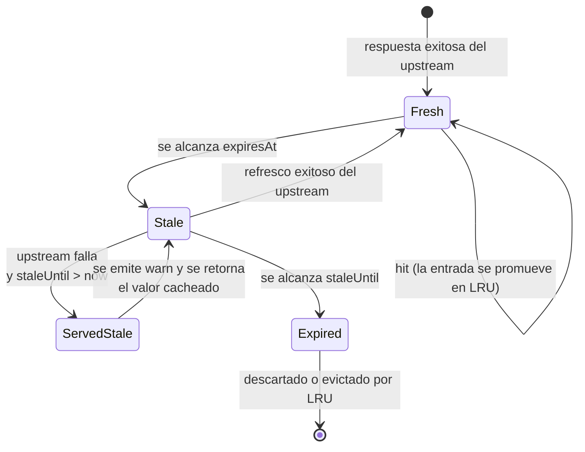

# Guía: caché y resiliencia

La librería incluye una caché en memoria con TTL, _stale-while-error_ opcional, evicción LRU y un backend pluggable para quienes necesiten Redis u otras implementaciones. Esta guía explica cuándo y cómo usar cada pieza.

## TL;DR

```typescript
import { getBcvRates } from 'bcv-exchange-rate';

// Default: caché activa por 60 segundos para toda URL scrapeada.
const bcv = await getBcvRates();

// Aumentar el TTL a 5 minutos.
await getBcvRates({ cacheTtlMs: 5 * 60_000 });

// Desactivar la caché para esta llamada.
await getBcvRates({ cacheTtlMs: 0 });

// Tolerar la caída del BCV durante hasta 10 minutos sirviendo datos vencidos.
await getBcvRates({ cacheTtlMs: 60_000, cacheStaleTtlMs: 10 * 60_000 });
```

## Default y controles básicos

Toda URL consultada se cachea por **60 000 ms (1 minuto)** por defecto, en un LRU en memoria compartido por el proceso.

| Opción            | Default    | Efecto                                                       |
| ----------------- | ---------- | ------------------------------------------------------------ |
| `cacheTtlMs`      | `60000`    | TTL _fresh_. `0` desactiva completamente la caché.           |
| `cacheStaleTtlMs` | `0`        | Ventana extra en la que se sirve stale si el upstream falla. |
| `cacheStore`      | LRU global | Backend custom (ver más abajo).                              |

La caché **nunca cachea errores**. Si el request falla, sólo se intenta servir un valor vencido si existe una entrada previa dentro de `cacheStaleTtlMs`.

## Estados posibles

Para una llamada con caché activa (`cacheTtlMs > 0`):



1. **Fresh hit.** Dentro de `expiresAt`: devuelve la caché sin tocar el upstream.
2. **Miss (fresh vencido).** Va al upstream. Si responde, actualiza la caché; si falla, intenta servir stale.
3. **Stale serve.** La entrada sigue dentro de `staleUntil` y el upstream falló: devuelve el valor vencido y emite un `warn`.
4. **Hard miss.** No hay entrada o se pasó `staleUntil`: propaga el error.

## Stale-while-error: resiliencia ante caídas del BCV

El BCV tiene ventanas de indisponibilidad frecuentes. La opción `cacheStaleTtlMs` permite degradar de forma elegante:

```typescript
// Devuelve la última tasa buena si el BCV está caído, hasta 15 minutos después de que expire el fresh.
const rates = await getBcvRates({
  cacheTtlMs: 60_000,
  cacheStaleTtlMs: 15 * 60_000,
});
```

Cuando se sirve una respuesta stale, la librería emite:

```json
{
  "level": "warn",
  "message": "Serving stale cache after upstream failure",
  "key": "bcv:current",
  "error": "Request failed after 1 attempts: Request failed with status code 500"
}
```

Monitorea esta línea para detectar cuánto tiempo lleva caído el BCV antes de que te afecte realmente.

### Combinación recomendada para APIs de producción

```typescript
await getBcvRates({
  retries: 3,
  retryDelayMs: 500,
  cacheTtlMs: 60_000,
  cacheStaleTtlMs: 30 * 60_000,
});
```

Con esta configuración:

- Hasta **3 reintentos** automáticos por petición.
- La caché fresh de **1 minuto** evita golpear al BCV más de ~60 veces por hora.
- El stale de **30 minutos** mantiene tu endpoint respondiendo aunque el BCV caiga por media hora.

## Evicción LRU

La caché por defecto usa una política **Least-Recently-Used** con un límite de entradas (200 por defecto). Al alcanzar el límite, la entrada usada menos recientemente se descarta.

Ajusta el tamaño instalando un nuevo store global:

```typescript
import { setDefaultCache, createInMemoryCache } from 'bcv-exchange-rate';

setDefaultCache(createInMemoryCache({ maxEntries: 1000 }));
```

O inyecta un store sólo para una llamada concreta (sin tocar el global):

```typescript
const myStore = createInMemoryCache({ maxEntries: 50 });
await getBcvRates({ cacheStore: myStore });
```

## Observabilidad: `getCacheStats` y `resetCacheStats`

```typescript
import { getCacheStats, resetCacheStats } from 'bcv-exchange-rate';

// Métricas agregadas desde la última llamada a resetCacheStats().
const stats = getCacheStats();
// { hits: 142, misses: 37, staleServes: 3, size: 18 }
```

| Campo         | Significado                                                               |
| ------------- | ------------------------------------------------------------------------- |
| `hits`        | Número total de llamadas servidas desde la caché fresca.                  |
| `misses`      | Llamadas que tuvieron que ir al upstream.                                 |
| `staleServes` | Llamadas degradadas que sirvieron caché stale ante un fallo del upstream. |
| `size`        | Entradas actuales en la caché por defecto (no refleja los stores custom). |

Úsalo para emitir métricas a Prometheus o Datadog:

```typescript
setInterval(() => {
  const s = getCacheStats();
  metrics.gauge('bcv.cache.hits', s.hits);
  metrics.gauge('bcv.cache.misses', s.misses);
  metrics.gauge('bcv.cache.stale_serves', s.staleServes);
  metrics.gauge('bcv.cache.size', s.size);
}, 30_000);
```

## Backend custom: la interfaz `CacheStore`

```typescript
interface CacheStore {
  readonly size: number;
  get(key: string): CacheEntry | undefined;
  set(key: string, entry: CacheEntry): void;
  delete(key: string): void;
  clear(): void;
}

interface CacheEntry<T = unknown> {
  value: T;
  expiresAt: number; // epoch ms — deadline de fresh
  staleUntil: number; // epoch ms — deadline de stale
}
```

La interfaz es **síncrona** por diseño. Es un compromiso consciente:

- **A favor:** mantiene el flujo de llamada simple y rápido (un hit no hace un `await` innecesario).
- **En contra:** no puedes conectar Redis directamente. Si necesitas persistencia compartida entre procesos, escribe un **adaptador síncrono respaldado por una caché local**:

```typescript
import { CacheStore, CacheEntry, createInMemoryCache } from 'bcv-exchange-rate';
import { createClient } from 'redis';

const redis = createClient();
await redis.connect();

function redisBackedStore(localMaxEntries = 200): CacheStore {
  const local = createInMemoryCache({ maxEntries: localMaxEntries });

  return {
    get size() {
      return local.size;
    },
    get: (key) => local.get(key), // hot path síncrono
    set: (key, entry) => {
      local.set(key, entry);
      // Fire-and-forget a Redis para persistencia compartida.
      redis.setEx(`bcv:${key}`, Math.ceil((entry.staleUntil - Date.now()) / 1000), JSON.stringify(entry));
    },
    delete: (key) => {
      local.delete(key);
      redis.del(`bcv:${key}`);
    },
    clear: () => {
      local.clear();
      // Purga por prefijo en Redis si aplica.
    },
  };
}
```

Calentamiento del local desde Redis al arrancar:

```typescript
async function warmFromRedis(store: CacheStore): Promise<void> {
  const keys = await redis.keys('bcv:*');
  for (const fullKey of keys) {
    const raw = await redis.get(fullKey);
    if (!raw) continue;
    const entry: CacheEntry = JSON.parse(raw);
    if (entry.staleUntil > Date.now()) {
      store.set(fullKey.replace(/^bcv:/, ''), entry);
    }
  }
}
```

## Claves de caché

Las claves son **determinísticas** y se basan en la URL:

| Función         | Clave                                               |
| --------------- | --------------------------------------------------- |
| `getBcvRates`   | `bcv:current` (sólo la portada)                     |
| `getBcvHistory` | `bcv:history:<url completa incluyendo page y days>` |
| `getTrmRates`   | `trm:<url completa incluyendo limit y offset>`      |

Múltiples consumidores con distintos `cacheTtlMs` comparten la entrada: el primero que la puebla define el TTL efectivo hasta que expire.

Las claves son un detalle de implementación y pueden cambiar entre versiones menores. No construyas dependencias externas basadas en estos nombres.

## API de administración

```typescript
import {
  clearCache,
  createInMemoryCache,
  setDefaultCache,
  getDefaultCache,
  getCacheStats,
  resetCacheStats,
} from 'bcv-exchange-rate';
```

| Función                   | Qué hace                                                                 |
| ------------------------- | ------------------------------------------------------------------------ |
| `clearCache()`            | Vacía la caché por defecto. No toca los stores inyectados por llamada.   |
| `createInMemoryCache(o?)` | Crea un LRU en memoria nuevo. Útil para inyectarlo en llamadas aisladas. |
| `setDefaultCache(store)`  | Reemplaza la caché global por defecto. Ideal para backends con Redis.    |
| `getDefaultCache()`       | Devuelve la instancia actual del default. Útil en pruebas.               |
| `getCacheStats()`         | Snapshot de contadores más el tamaño del default.                        |
| `resetCacheStats()`       | Pone `hits`, `misses` y `staleServes` en cero. No toca las entradas.     |

## Casos de uso y configuraciones sugeridas

### API pública de bajo tráfico

```typescript
{ cacheTtlMs: 60_000, cacheStaleTtlMs: 5 * 60_000, retries: 2 }
```

### Dashboard en tiempo real con muchos clientes

```typescript
{ cacheTtlMs: 30_000, cacheStaleTtlMs: 30 * 60_000, retries: 3 }
```

### Proceso por lotes diario o reporte

```typescript
{ cacheTtlMs: 0, retries: 5, retryDelayMs: 2000 }
// Sin caché: quieres dato fresco. Reintentos largos porque puedes esperar.
```

### Pruebas de integración

```typescript
{
  cacheTtlMs: 0;
}
// Evita resultados inestables por caché cruzada entre pruebas.
```

## Consideraciones importantes

- **La caché vive en el heap del proceso.** No sobrevive a reinicios. Para persistencia, usa un `cacheStore` custom.
- **No hay invalidación fina.** La clave se basa en la URL; no puedes borrar «sólo USD» sin borrar toda la portada. Usa `clearCache()` o `store.delete(key)` manualmente.
- **Las estadísticas son globales al proceso.** No se reinician automáticamente; llama `resetCacheStats()` en intervalos si las exportas.
- **`cacheStaleTtlMs: 0` desactiva el stale-while-error.** Un fallo tras la expiración del fresh se propaga inmediatamente.
- **Los stores custom no se reflejan en `getCacheStats().size`.** Los contadores (`hits`, `misses`, `staleServes`) sí se actualizan porque son globales a `withCache`.
