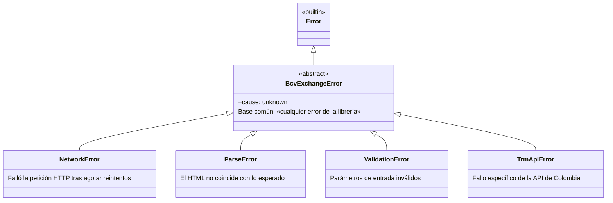

# Guía: manejo de errores

La librería expone una jerarquía de clases de error tipada para que puedas discriminar casos sin inspeccionar `message`.

## Jerarquía



Todas las clases exponen `cause`, que contiene el error original envuelto:

```typescript
import { NetworkError } from 'bcv-exchange-rate';

try {
  await getBcvHistory({ days: 30 });
} catch (err) {
  if (err instanceof NetworkError) {
    console.error('Red:', err.message, 'original:', err.cause);
  }
}
```

## Mapa de qué lanza qué

| Función          | `ValidationError` | `NetworkError`         | `TrmApiError` | `ParseError` | Retorna `null` |
| ---------------- | ----------------- | ---------------------- | ------------- | ------------ | -------------- |
| `getBcvRates`    | sí                | sí (si sólo una sección) | no          | no           | no             |
| `getBcvHistory`  | sí                | sí                     | no            | no           | no             |
| `getTrmRates`    | sí                | no                     | sí            | no           | sí (sin datos) |

## Contrato asimétrico de `getBcvRates`

Es el caso más sutil. Cuando solicitas **ambas** secciones (`includeCurrent: true, includeHistory: true`):

- Si `current` falla, se marca `status.current = 'failed'` y se intenta `history`. **No lanza.**
- Si `history` falla, se marca `status.history = 'failed'` y `history: []`. **No lanza.**
- Si ambas fallan, ambos estados quedan en `'failed'` con los arreglos vacíos. **No lanza.**

Cuando solicitas **sólo una** sección:

- Si falla, **lanza** la excepción correspondiente.

### Ejemplo: diferenciar fallo parcial frente a total

```typescript
import { getBcvRates } from 'bcv-exchange-rate';

const result = await getBcvRates();

if (result.status.current === 'failed' && result.status.history === 'failed') {
  // Ambas fallaron, se trata como degradación total.
  throw new Error('BCV completamente inaccesible');
}

if (result.status.current === 'failed') {
  console.warn('Tasa actual no disponible, se sirve el histórico');
  return pickMostRecentFromHistory(result.history);
}

return result.current;
```

## Patrones de captura

### Sólo «red caída»

```typescript
import { NetworkError, TrmApiError } from 'bcv-exchange-rate';

try {
  const trm = await getTrmRates();
  // ...
} catch (err) {
  if (err instanceof NetworkError || err instanceof TrmApiError) {
    await fallbackToCachedValue();
    return;
  }
  throw err;
}
```

### Ignorar errores de validación en desarrollo, propagar en producción

```typescript
import { ValidationError } from 'bcv-exchange-rate';

try {
  await getBcvRates({ days: userInput });
} catch (err) {
  if (err instanceof ValidationError && process.env.NODE_ENV === 'development') {
    console.error('Entrada inválida, se usan los valores por defecto:', err.message);
    return getBcvRates();
  }
  throw err;
}
```

### Agrupar por «cualquier error de la librería»

```typescript
import { BcvExchangeError } from 'bcv-exchange-rate';

try {
  // ...
} catch (err) {
  if (err instanceof BcvExchangeError) {
    metrics.increment('bcv.errors', { type: err.name });
  }
  throw err;
}
```

## Reintentos integrados

Tanto `NetworkError` como `TrmApiError` sólo se lanzan tras agotar los reintentos configurados. No hace falta implementar reintentos manuales en el consumidor, salvo que quieras _circuit breaking_ externo. Ajusta mediante `retries` y `retryDelayMs`:

```typescript
await getBcvHistory({ retries: 5, retryDelayMs: 1000 });
// Esperas: 1000, 2000, 4000, 8000 y 16000 ms entre intentos.
```

Detalles completos en la [guía de reintentos](./retries.md).

## Valores parciales (`null`, `'failed'`)

La librería distingue tres formas de «no hay datos»:

1. **`null`** (sólo `getTrmRates`): la API respondió sin registros. No es un error.
2. **`status: 'failed'`** (`getBcvRates`): la sección se solicitó y falló, pero otra sección sí pudo servirse.
3. **Excepción**: nada útil pudo recuperarse.

Trata cada caso según tu tolerancia. En dashboards, degrada silenciosamente con un aviso al usuario; en procesos por lotes, prefiere una falla ruidosa.
